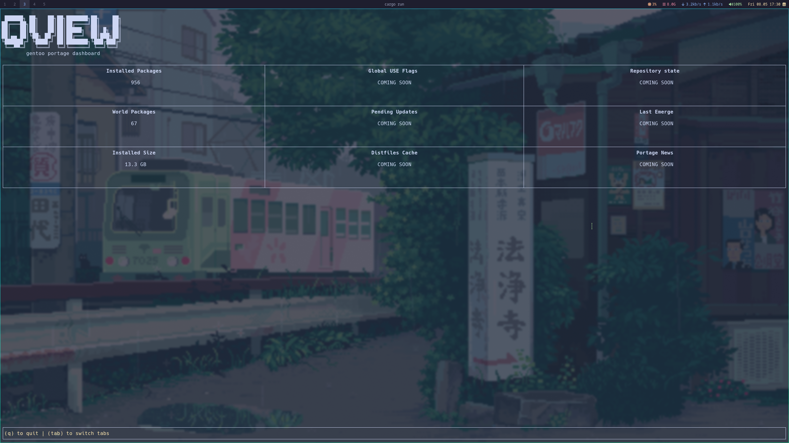
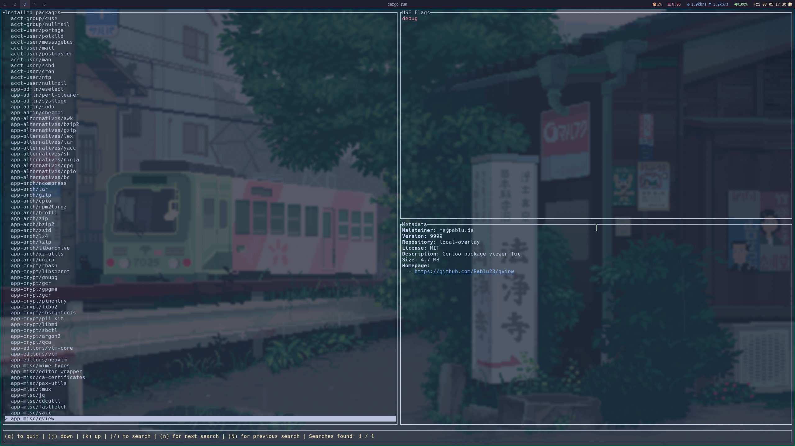
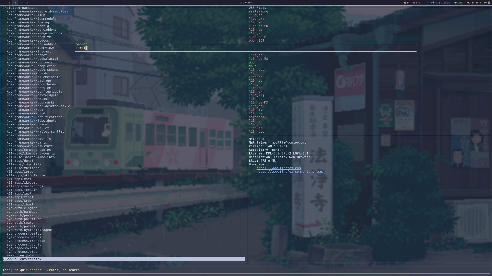

# qview

A terminal dashboard for exploring and inspecting a Gentoo system using Portage metadata.

Built with Rust and Ratatui.

---

## Features

* Browse installed Gentoo packages
* Inspect package metadata
  * Version
  * Repository
  * Maintainer
  * License
  * Homepage
  * Installed size
* View package USE flags
  * Enabled flags
  * Default flags
* Search installed packages
* Dashboard overview
  * Installed package count
  * World package count
  * Installed size

---

## Screenshots

Ui changes kind of frequently right now, take these with a grain of salt

### Dashboard



### Installed Packages View




### Search Popup



---

## Installation

### Gentoo (via guru overlay)

qview is available as an ebuild in the official [Gentoo guru overlay](https://wiki.gentoo.org/wiki/Project:GURU).

Install with:

```bash
emerge app-misc/qview
```

### Build from source

Requirements:
* Rust (stable)
* Cargo
* Gentoo Linux

Clone the repository:

```bash
git clone https://github.com/Pablu23/qview
cd qview
```

Build:

```bash
cargo build --release
```

Run:

```bash
./target/release/qview
```

---

## Development Environment

This repository includes a `flake.nix` for development environments.

The flake is intended for:
* dependency management
* reproducible development shells
* editor tooling

It is **not currently used for building or packaging qview itself**.

Enter the development shell with:

```bash
nix develop
```

---

## Roadmap

The project is still early in development. Planned features include:
- [x] Public guru ebuild
- [x] Portage package search/browser
  - [x] Nicer loading screen
- [ ] Improved information in package metadata
  - [ ] RDEPEND
  - [ ] BDEPEND
  - [ ] SLOT
  - [ ] Keywords
  - [ ] New version available?
- [ ] Filtering installed packages
  - [x] World packages
  - [ ] Explicitly installed packages
  - [ ] Repository filters
  - [ ] USE flag filters
- [x] Better package USE Flag rendering
- [ ] Improved dashboard statistics
- [ ] Portage news reader
- [x] Search improvements
- [ ] Sorting options
- [x] Async package metadata loading
- [ ] Logging
- [ ] Reading ebuild files directly instead of using pre-computed

---

## Motivation

qview exists to provide a lightweight terminal interface for exploring Gentoo package information without repeatedly invoking multiple Portage utilities manually.

The focus is:
* fast navigation
* clean terminal UX
* useful metadata presentation
* native Gentoo integration

---

## License

MIT License

Copyright 2026 Pablu

Permission is hereby granted, free of charge, to any person obtaining a copy of this software and associated documentation files (the “Software”), to deal in the Software without restriction, including without limitation the rights to use, copy, modify, merge, publish, distribute, sublicense, and/or sell copies of the Software, and to permit persons to whom the Software is furnished to do so, subject to the following conditions:

The above copyright notice and this permission notice shall be included in all copies or substantial portions of the Software.

THE SOFTWARE IS PROVIDED “AS IS”, WITHOUT WARRANTY OF ANY KIND, EXPRESS OR IMPLIED, INCLUDING BUT NOT LIMITED TO THE WARRANTIES OF MERCHANTABILITY, FITNESS FOR A PARTICULAR PURPOSE AND NONINFRINGEMENT. IN NO EVENT SHALL THE AUTHORS OR COPYRIGHT HOLDERS BE LIABLE FOR ANY CLAIM, DAMAGES OR OTHER LIABILITY, WHETHER IN AN ACTION OF CONTRACT, TORT OR OTHERWISE, ARISING FROM, OUT OF OR IN CONNECTION WITH THE SOFTWARE OR THE USE OR OTHER DEALINGS IN THE SOFTWARE.


> Documentation written with AI assistance and edited for accuracy.
